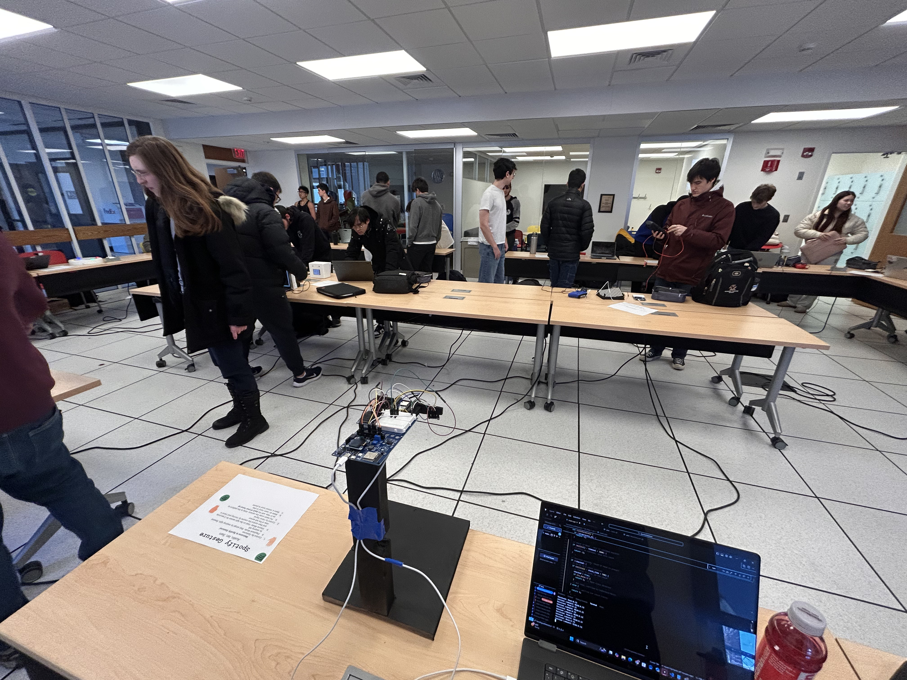

# SpotifyGesture

[](https://newmie10.github.io/SpotifyGesture/)
[](https://github.com/newmie10/SpotifyGesture)

> **Gesture-Controlled Music Experience**: Control Spotify with intuitive hand gestures and swipes using computer vision and Time-of-Flight sensors.



## 🎯 Project Overview

SpotifyGesture is a hands-free music control system that enables users to control Spotify using intuitive hand gestures and swipes. Perfect for situations where traditional controls are inconvenient or unsafe—like driving, studying, or working. Built for **CICS 256: Make** at UMass Amherst (Fall 2025).

### Key Features

- 🖐️ **Hand Gesture Recognition**: CNN-based hand detection for play/pause controls (open palm = play, closed fist = pause)
- 👋 **Swipe Detection**: ToF sensor-based left/right gestures for skipping/rewinding songs
- 🔊 **Distance-Based Volume Control**: Adjust volume by holding your hand at different distances
- ⚡ **Real-Time Processing**: ~1.5s inference time with <500ms system latency
- 🎵 **Direct Spotify Integration**: Seamless control through Spotify Web API
- 🖥️ **Custom Apparatus**: 3D-printed mounts with wooden base for optimal sensor and camera positioning

### Performance Metrics

| Metric | Value |
|--------|-------|
| Test Set Accuracy | 100% |
| Real-Time Accuracy | 100% |
| Noise Robustness (5% Gaussian) | 80% |
| Rotation Invariance | 100% |
| Inference Time | ~1.5s |
| System Latency | <500ms |
| Input Resolution | 48×48 |
| Model Precision | int8 quantized |
| ToF Detection Range | 30cm baseline |

## Repository Structure

```
SpotifyGesture/
├── HandDetector/              # ML model for hand gesture recognition
│   ├── Training notebooks
│   ├── Model architecture
│   ├── Data preprocessing
│   └── Quantization for ESP32
│
├── WaveDetector/              # ToF sensor gesture detection & Spotify API
│   ├── ESP32 firmware
│   ├── Sensor processing
│   ├── Spotify API integration
│   └── Serial communication
│
├── project_display/           # Project showcase website
│   ├── Interactive 3D model viewer
│   ├── Documentation
│   └── Team information
│
├── public/                    # Assets and media
│   ├── HardwareDesign/       # Hardware construction images
│   ├── HandDetector/         # ML model training images
│   └── Demo videos
│
└── README.md                  # This file
```

## 🔧 Hardware Components

- **1× ESP32-S3-CAM (16MB/8MB)** - Main board with integrated camera for hand detection
- **1× Makerboard** - Secondary board for ToF sensor management (after S3 serial clock failure)
- **2× VL53L1X ToF Distance Sensors** - Gesture detection via laser ranging
- **1× OV2640 Camera Module** - Hand position capture for CNN inference
- **15+ Jumper Wires** - Inter-board communication
- **1× USB-C Cable** - Power and data connection
- **Custom 3D-Printed Mounts** - Sensor positioning and ESP32 mounting
- **Wooden Base Platform** - 14" height apparatus with matte black finish

## 🚀 Getting Started

### Prerequisites

- ESP32 development environment (Arduino IDE or PlatformIO)
- Python 3.8+ (for ML model training)
- Node.js 16+ (for website development)
- Spotify Premium account (for API access)

### Hardware Setup

1. **Build the Apparatus**: Follow instructions in `Apparatus_Design.md`
2. **Mount Components**: Install ESP32-S3-CAM, ToF sensors, and camera using 3D-printed mounts
3. **Wire Connections**: Connect ToF sensors to Makerboard via I2C, then to ESP32 via serial

### Software Setup

#### 1. Hand Detection Model

```bash
cd HandDetector/
# Follow instructions in HandDetector/Handnet_Plan.md
# Train model, quantize to int8, deploy to ESP32
```

#### 2. Gesture Detection & Spotify API

```bash
cd WaveDetector/
# Follow instructions in WaveDetector/EngineeringProcess.md
# Configure Spotify API credentials
# Flash firmware to ESP32
```

#### 3. Project Website

```bash
cd project_display/
npm install
npm run dev  # Development server
npm run build  # Production build
```

For detailed website setup, see [`project_display/README.md`](project_display/README.md).

## 💻 Technologies

### Machine Learning
- **TensorFlow / TensorFlow Lite** - Model training and deployment
- **Python** (NumPy, Pandas, Matplotlib) - Data processing and visualization
- **int8 Quantization** - Model optimization for embedded deployment
- **Image Preprocessing** - Data augmentation and normalization

### Embedded Systems
- **Arduino / C++** - Firmware development
- **ESP32-S3-CAM** - Main processing unit
- **I2C Protocol** - Sensor communication
- **Serial Communication** - Inter-board data transfer

### Hardware & Sensors
- **VL53L1X ToF Sensors** - Laser-based distance measurement
- **OV2640 Camera** - 2MP image capture
- **3D Printing** - Custom mounting solutions
- **Woodworking** - Apparatus base construction

### Web & APIs
- **Spotify Web API** - Music control integration
- **OAuth 2.0** - Authentication flow
- **React + Vite** - Website frontend
- **Three.js / React Three Fiber** - 3D model visualization

## 🎓 Engineering Process

### 1. Concept & Planning
Initial brainstorming, feature definition, and technical feasibility analysis. Pivot from original Olympia Place project to gesture control system.

### 2. Hardware Design
Iterative apparatus construction using wood, 3D-printed mounts, and careful sensor positioning. Matte black finish to reduce visual noise for camera.

### 3. Hand Detection Model (Austin)
CNN development, data collection, training, quantization to int8, and optimization for ~1.5s inference on ESP32-S3.

### 4. Gesture Detection (Sam)
ToF sensor calibration, swipe algorithm development, distance-based volume control, and real-time sensor fusion.

### 5. System Integration (Sam & Ian)
Spotify API setup, OAuth implementation, serial communication between boards, system testing, and demo day preparation.

For detailed engineering notes, see:
- `HandDetector/Handnet_Plan.md`
- `WaveDetector/EngineeringProcess.md`
- `Apparatus_Design.md`

## 👥 Team

| Member | Role | Contributions |
|--------|------|---------------|
| **Austin Fairbanks** | ML Engineer | Hand detection CNN, camera integration, model quantization, apparatus design |
| **Ian Rapko** | Systems Engineer | Hardware integration, screen testing, code migration, apparatus construction |
| **Sam Newman** | Embedded & API Developer | ToF gesture detection, Spotify API integration, sensor control, serial communication |

**Course:** CICS 256 - Make: A Hands-on Introduction to Physical Computing  
**Institution:** University of Massachusetts Amherst  
**Semester:** Fall 2025  
**Instructor:** Professor Md Farhan Tanism

### Acknowledgments

Special thanks to:
- **Professor Md Farhan Tanism** and the CICS 256 course staff for guidance and support
- **UMass CICS Makerspace** staff for 3D printing and hardware assistance
- **All-Campus Makerspace** staff for woodworking tools and expertise

## 🎬 Demo

Watch SpotifyGesture in action:

- **[POV Demo](project_display/public/POV_Demo.mp4)** - First-person view of gesture controls
- **[Third Person Demo](project_display/public/Third_Person_Demo.mp4)** - External view of the apparatus

Or visit the [live project website](https://newmie10.github.io/SpotifyGesture/) for embedded videos and full documentation.

## 🏆 Achievements

- ✅ **Grade:** A on final project
- 🏅 **Recognition:** Top 40% of projects in the course
- 🎯 **Functionality:** System worked reliably for most demo day participants
- 🎵 **Engagement:** Hosted Spotify Jam sessions for attendees to play their own music
- 📈 **Accuracy:** 100% real-time gesture recognition in controlled environment

### Challenges Overcome

1. **Model Optimization**: Reduced inference time from 3-4s to ~1.5s through quantization and input size reduction (64×64 → 48×48)
2. **Hardware Failure**: Adapted to ESP32 serial clock failure by implementing two-board architecture
3. **Background Noise**: Solved camera noise issues by pointing sensors downward and using matte black background
4. **Spotify Integration**: Successfully implemented OAuth flow and real-time playback control
5. **Project Pivot**: Completely changed project scope mid-semester due to unforeseen circumstances with original proposal

## 🔮 Future Work

Given more time, we would implement:

- **Single Board Integration**: Consolidate functionality onto one ESP32 board
- **Compact Design**: Smaller, more portable form factor
- **OLED Screen**: Real-time display of song info and gesture feedback
- **Enhanced Visual Feedback**: Better Spotify API integration with live track information
- **Audio Confirmation**: Buzzer/speaker for inference completion signals
- **Custom PCB**: Purpose-built circuit board with proper space allocation
- **Additional Gestures**: Expand vocabulary for playlist navigation, repeat/shuffle modes

## 📝 Documentation

- **[Project Website](https://newmie10.github.io/SpotifyGesture/)** - Interactive showcase with 3D model
- **[Hand Detection Process](HandDetector/Handnet_Plan.md)** - ML model development
- **[Gesture Detection Process](WaveDetector/EngineeringProcess.md)** - Sensor integration and API
- **[Apparatus Design](Apparatus_Design.md)** - Hardware construction details

## 📄 License

© 2025 SpotifyGesture Team. Created for CICS 256 at UMass Amherst.

This project was developed for educational purposes as part of coursework at the University of Massachusetts Amherst.

## 🔗 Links

- **Live Website**: [https://newmie10.github.io/SpotifyGesture/](https://newmie10.github.io/SpotifyGesture/)
- **GitHub Repository**: [https://github.com/newmie10/SpotifyGesture](https://github.com/newmie10/SpotifyGesture)

---

<div align="center">

**Built with ❤️ for CICS 256 at UMass Amherst**

*Making music control magical through physical computing*

</div>